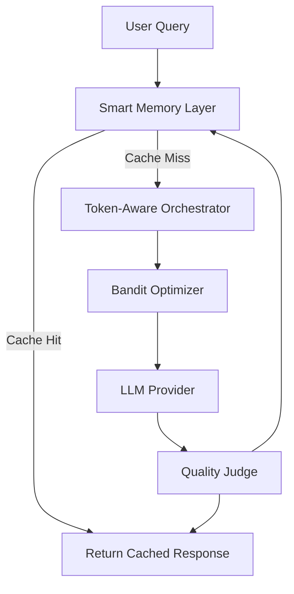

# System Overview

The Tokenomics Platform is a production-ready system for optimizing LLM token usage while maintaining response quality.

## Core Components

### 1. Smart Memory Layer

**Purpose:** Reduce token usage through intelligent caching

**Features:**
- Exact cache for identical queries (0 tokens)
- Semantic cache for similar queries (context injection)
- Vector similarity search (FAISS/ChromaDB)
- LLMLingua compression for long queries/contexts

**Location:** `tokenomics/memory/`

### 2. Token-Aware Orchestrator

**Purpose:** Optimize token allocation across query components

**Features:**
- Query complexity analysis (simple/medium/complex)
- Dynamic token allocation (knapsack optimization)
- Query planning and prompt building
- Multi-model routing support

**Location:** `tokenomics/orchestrator/`

### 3. Bandit Optimizer

**Purpose:** Learn optimal routing strategies over time

**Features:**
- RouterBench-style cost-quality routing
- UCB algorithm for exploration/exploitation
- Strategy selection (cheap/balanced/premium)
- Adaptive learning from past performance

**Location:** `tokenomics/bandit/`

## System Flow

## Performance

- **Token Savings:** 45.9% average reduction
- **Quality Maintained:** 92%
- **Cache Hit Rate:** 31%
- **Cost Reduction:** 30-80% for simple queries

## Documentation

- [Components](components.md) - Detailed component documentation
- [Routing](routing.md) - Routing architecture
- [Memory](memory.md) - Memory layer details
- [ARCHITECTURE.md](../../ARCHITECTURE.md) - High-level architecture

