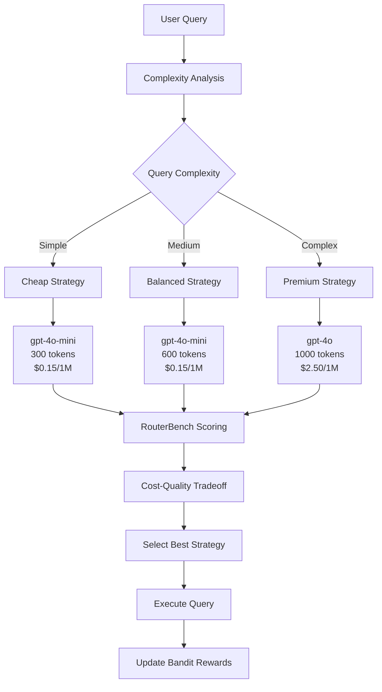

# Routing Architecture

## Overview

The Tokenomics Platform uses a **RouterBench-style cost-aware routing system** with a **multi-armed bandit optimizer** to intelligently route queries to the most appropriate model based on query complexity, cost, and quality tradeoffs.

## Router Type

**Hybrid RouterBench + Multi-Armed Bandit (UCB algorithm)**

The routing system combines:
1. **RouterBench Cost-Quality Routing** - Considers cost, quality, and latency
2. **Multi-Armed Bandit Optimizer** - Learns which strategies work best over time
3. **Complexity-Based Routing** - Routes based on semantic query analysis

## Single API Key Architecture

**Yes, the platform uses a single API key** (OpenAI API key in the default configuration).

**How it works:**
- One API key is configured in `.env` file
- The router selects which **model** to use from the same provider
- All models use the same API key, but different models have different:
  - **Costs** (gpt-4o-mini: $0.15/1M tokens vs gpt-4o: $2.50/1M tokens)
  - **Capabilities** (gpt-4o-mini: faster/cheaper vs gpt-4o: more powerful)
  - **Token limits** (cheap: 300 tokens, balanced: 600 tokens, premium: 1000 tokens)

**Model Routing:**
- **Simple queries** → `gpt-4o-mini` (cheap strategy, 300 tokens)
- **Medium queries** → `gpt-4o-mini` (balanced strategy, 600 tokens)  
- **Complex queries** → `gpt-4o` (premium strategy, 1000 tokens)

All use the same OpenAI API key, just different model endpoints.

## Routing Pipeline Flow



## How Model Selection Works

### Step 1: Complexity Analysis

**Location:** `tokenomics/orchestrator/orchestrator.py` - `analyze_complexity()`

**Method:** Keyword-based semantic analysis + token count

```python
# Complex indicators: "design", "architecture", "comprehensive", etc.
# Medium indicators: "how does", "explain", "difference", etc.

if complex_score >= 2 or (token_count >= 50 and complex_score >= 1):
    return COMPLEX
elif medium_score >= 1 or token_count >= 15:
    return MEDIUM
else:
    return SIMPLE
```

**Output:** `simple`, `medium`, or `complex`

### Step 2: Strategy Selection (RouterBench)

**Location:** `tokenomics/bandit/bandit.py` - `select_strategy_cost_aware()`

**Available Strategies:**

| Strategy | Model | Max Tokens | Cost/1M | Use Case |
|----------|-------|------------|---------|----------|
| **cheap** | gpt-4o-mini | 300 | $0.15 | Simple queries |
| **balanced** | gpt-4o-mini | 600 | $0.15 | Medium queries |
| **premium** | gpt-4o | 1000 | $2.50 | Complex queries |

**Selection Criteria:**

1. **Complexity-Based Penalties:**
   - Simple queries: Penalize expensive strategies (30% penalty for premium)
   - Medium queries: Slight preference for balanced (10% penalty for cheap)
   - Complex queries: Penalize cheap strategies (20% penalty)

2. **RouterBench Efficiency Score:**
   ```
   Efficiency = (Quality × 0.5) + (Cost_Efficiency × 0.3) + (Speed × 0.2)
   ```

3. **Cost Calculation:**
   ```python
   cost = (tokens_used / 1_000_000) × model_cost_per_million
   ```

4. **Reward Function:**
   ```python
   reward = quality × (1 - cost_weight × normalized_cost) × (1 - latency_weight × normalized_latency)
   ```

### Step 3: Model Assignment

**Location:** `tokenomics/core.py` - Line 445-446

```python
# Strategy selected by bandit
strategy = self.bandit.select_strategy_cost_aware(query_complexity=complexity)

# Model assigned to plan
if strategy:
    plan.model = strategy.model  # e.g., "gpt-4o-mini" or "gpt-4o"
```

**Result:** The query is sent to the selected model using the same API key.

## Selection Basis: Multi-Factor Decision

The router chooses models based on **5 factors**:

### 1. **Query Complexity** (Primary)
- Simple → Cheap model (gpt-4o-mini, 300 tokens)
- Medium → Balanced model (gpt-4o-mini, 600 tokens)
- Complex → Premium model (gpt-4o, 1000 tokens)

### 2. **Cost Efficiency** (RouterBench)
- Tracks cost per query for each strategy
- Prefers cheaper models when quality is equivalent
- Formula: `cost_per_million × tokens_used`

### 3. **Quality Score** (RouterBench)
- Tracks response quality (from quality judge)
- Balances quality vs cost
- Higher quality = higher reward

### 4. **Latency** (RouterBench)
- Faster responses get higher scores
- Normalized: `latency_ms / 30000`

### 5. **Historical Performance** (Bandit Learning)
- UCB algorithm tracks which strategies perform best
- Explores new strategies, exploits successful ones
- Updates rewards after each query

## RouterBench Metrics

**Location:** `tokenomics/bandit/bandit.py` - `RoutingMetrics` class

**Tracked Metrics:**
- `total_cost` - Cumulative cost across all queries
- `total_tokens` - Total tokens used
- `total_latency_ms` - Total latency
- `total_quality` - Cumulative quality scores
- `avg_cost_per_query` - Average cost
- `efficiency_score` - Combined efficiency metric

**Efficiency Score Formula:**
```python
efficiency = (avg_quality × 0.5) + (cost_efficiency × 0.3) + (speed × 0.2)
```

## Example Routing Decision

**Query:** "Design a comprehensive microservices architecture for an e-commerce platform"

**Step 1: Complexity Analysis**
- Keywords: "design", "architecture", "comprehensive" → `complex_score = 3`
- Result: **COMPLEX**

**Step 2: Strategy Selection**
- Complexity: `complex`
- Available strategies: cheap, balanced, premium
- Penalties applied:
  - Cheap: 20% penalty (too weak for complex query)
  - Balanced: No penalty
  - Premium: No penalty (ideal for complex)
- Efficiency scores compared
- **Selected: premium** (gpt-4o, 1000 tokens)

**Step 3: Execution**
- Query sent to `gpt-4o` model
- Uses same OpenAI API key
- Max tokens: 1000
- Cost: $2.50 per 1M tokens

**Step 4: Learning**
- Quality judge evaluates response
- Reward calculated: `quality × (1 - cost_penalty) × (1 - latency_penalty)`
- Bandit updates premium strategy's average reward
- Future complex queries more likely to use premium

## Key Points

1. **Single API Key:** Yes, one OpenAI API key routes to different models
2. **Router Type:** RouterBench-style cost-aware + Multi-Armed Bandit (UCB)
3. **Selection Basis:** Complexity + Cost + Quality + Latency + Historical Performance
4. **Learning:** Bandit learns which strategies work best over time
5. **Adaptive:** Adjusts routing based on query characteristics and past performance

## Current Configuration

**Provider:** OpenAI  
**API Key:** Single key (configured in `.env`)  
**Models Used:**
- `gpt-4o-mini` (cheap/balanced strategies)
- `gpt-4o` (premium strategy)

**Routing Algorithm:** UCB (Upper Confidence Bound) with RouterBench cost-quality optimization

## Why This Approach?

1. **Cost Optimization:** Routes simple queries to cheaper models
2. **Quality Maintenance:** Uses powerful models for complex queries
3. **Adaptive Learning:** Bandit learns optimal routing over time
4. **Multi-Factor:** Considers cost, quality, latency, not just one factor
5. **RouterBench Standard:** Based on research-backed routing methodology

The router is **intelligent, adaptive, and cost-aware** - it learns which models work best for different query types while optimizing for cost and quality.


